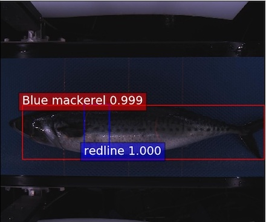
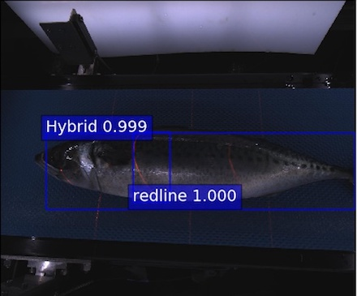

# Mackerel Classification using Faster R-CNN + GLCC

PyTorch implementation for vgg16 Faster R-CNN with GLCC (Global and Local features Conjunct Classifier).

Original Paper >> https://ieeexplore.ieee.org/document/8717584

This is from faster r-cnn implemented with PyTorch (https://github.com/jwyang/faster-rcnn.pytorch).

This method is to classify mackerels into three category (blue mackerel, chub mackerle and hybrid (intermediate)).

***This needs GPU environment because original faster-rcnn.pytorch needs, too.*** If you find the method to use in CPU only environment, please tell me via issues or pull request:)

1. [Description](https://github.com/yoyoyo-yo/glcc-frcn.pytorch#1description) ([The Objective](https://github.com/yoyoyo-yo/glcc-frcn.pytorch#1-1the-objective), [Model](https://github.com/yoyoyo-yo/glcc-frcn.pytorch#1-2model) )
2. [Install](https://github.com/yoyoyo-yo/glcc-frcn.pytorch#2install)
3. [Result](https://github.com/yoyoyo-yo/glcc-frcn.pytorch#3result)
4. [GLCC train and test (we prepare pre-trained model)](https://github.com/yoyoyo-yo/glcc-frcn.pytorch#4glcc)
5. [Other model tips (we do not prepare pre-trained model)](https://github.com/yoyoyo-yo/glcc-frcn.pytorch#5other-model-tips)

## 1.Description

### 1-1.The objective

This is created under automatic mackerel categorization machine.

We have to classify mackerels to three species including blue mackerel, chub mackerel and hybrid(unknown or intermediate type).

While blue mackerels have dotted pattern abdomen, chub mackerel does not. Hybrids are difficult to distinguish because they have thin dotted pattern abdomen.

Other than above features, blue mackerel have round shape body shape, but chub mackerel eclipse like one. So, we used these features for accurate recognition.

| Blue mackerel | Chub mackerel | Hybrid |
|:---:|:---:|:---:|
||| 
| | | |

Our final objective is detection and recognition.

| Input | Output |
|:---:|:---:|
|  |  |


### 1-2.Model

The overall architecture is depicted in below image.

This prposed method is composed in 2 stage, the one is Faster R-CNN and the other is GLCC(Global and Local features Conjunct Classifier).

This model can be trained end-to-end. In experiment, we trained Faster R-CNN (1-st stage) to detect each region, next we trained GLCC and former VGG16 backbone.


**Algorythm**

1. The model detected global region (= overall mackerel region) and local region (= abdomen region of mackerel) by Faster R-CNN
2. GLCC, followed neural network, predicts mackerel species using global and local regions.

(Warning)In original paper, we used 7class for detecting global and local features, but we used 3class in this implementation.

## 2.Install

Follow faster-rcnn.pytorch

```bash
$ conda create python=3.6 -n frcn_glcc_pytorch
$ source activate frcn_glcc_pytorch
$ cd glcc-frcn.pytorch
$ pip install -r requirements.txt
$ pip install torch==0.4 torchvision
$ cd lib
$ sh make.sh
```

## 3.Result

We evaluated methods using own test dataset of mackerel.

### 3-1.Feature
- Global ... using mackerel's overall feature called *Global feature*
- Local ... using mackerel's partial feature called *Local feature*
- GLCC ... using both overall and partial features

### 3-2.Evaluation Metric
- Accuracy
- Detection ... @IoU=0.5
- speed ... average processing time for one image

### 3-3. Result
| Method | Backbone | Global feature | Local feature | Accuracy(%) | Detection(%) | speed[sec] |
| :---:|:---:|:---:|:---:|:---:|:---:|:---:|
| VGG16-Global  | VGG16     | ✓ |   | 87.64 | 100 | 0.1144 |
| VGG16-Local   | VGG16     |   | ✓ | 70.79 | 96.44 | 0.1166 |
| Res101-Global | ResNet101 | ✓ |   | 73.22 | 100 | 0.1120 |
| Res101-Local  | ResNet101 |   | ✓ | 80.15 | 97.00 | 0.1142 |
| ***VGG16-GLCC***    | VGG16     | ✓ | ✓ | **89.33** |   -  | 0.1479 |
| Res101-GLCC   | ResNet101 | ✓ | ✓ | 76.78 |   -  | 0.1452 |

#### Some result examples

prediction label is shown. Red is accurate, and blue is mistake. (all red-line prediction is blue, because we did not count them for accuracy)

| Blue mackerel | Chub mackerel | Hybrid |
|:---:|:---:|:---:|
|  |  |  |
|  |  |  |
|  |  |  |

## 4.GLCC 

### 4-1.train
```bash
# VGG16
$ sh scripts/train_vgg_2class.sh
$ sh scripts/train_vgg_glcc_2class.sh

# Res101
$ sh scripts/train_res101_2class.sh
$ sh scripts/train_res101_glcc_2class.sh
```

### 4-2.test

#### VGG16 model

You can get pre-trained model by next command.

```bash
$ mkdir models
$ cd models
$ wget https://drive.google.com/open?id=11bXl1mAVUDS4oAS8a4iiFfVU_uRw8px_ -O glcc_1_100_833.pth
$ wget https://drive.google.com/open?id=17cbX9OLMpXrerHGVgtl5YkJ7nUZRa967 -O glcc_faster_rcnn_1_100_833.pth
$ cd -
```

Test demonstration is below.

Detection and recognition result images will be stored in *result_vgg16_glcc_2class* (You can change directory path by changing *result_dir* in demo_glcc_2class.py).

```bash
$ python demo_glcc_2class.py --net vgg16
```


## 5.Other model tips

This is other back-bone model tips.

However, I do not prepare pre-trained model, sorry:(

### 5-1.GLCC + ResNet-101 model

Pre-trained model is not still prepared.

```
$ python demo_glcc_2class.py --net res101
```

### 5-2.Global feature
#### train

```bash
# VGG16
$ sh scripts/train_vgg_global.sh

# Res101
# sh scripts/train_res101_global.sh
```

#### test

Pre-trained model is not still prepared.

```bash
# VGG16
$ python demo_saba_global.py --net vgg16

# Res101
$ python demo_saba_global.py --net res101
```

### 5-3.Local feature
#### train

```bash
# VGG16
$ sh scripts/train_vgg_local.sh

# Res101
$ sh scripts/train_res101_local.sh
```

#### test

Pre-trained model is not still prepared.

```bash
# VGG16
$ python demo_saba_local.py --net vgg16

# Res101
$ python demo_saba_local.py --net res101
```

